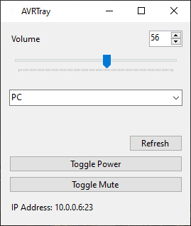

# AVRTray

A simple utilitarian Windows Forms .NET Core application for controlling any Marantz / Denon AVR that supports telnet commands

I made this because I can never find the remote while at my desk, and the AVR is often physically blocked by a door.
It minimizes to tray and supports basic power, volume and source control.

I'd use the Marantz HTTP-based web interface that was built into the AVR if they hadn't, you know, removed it for no reason.

Uses a few functions borrowed from https://github.com/RickDB/DenonWeb

